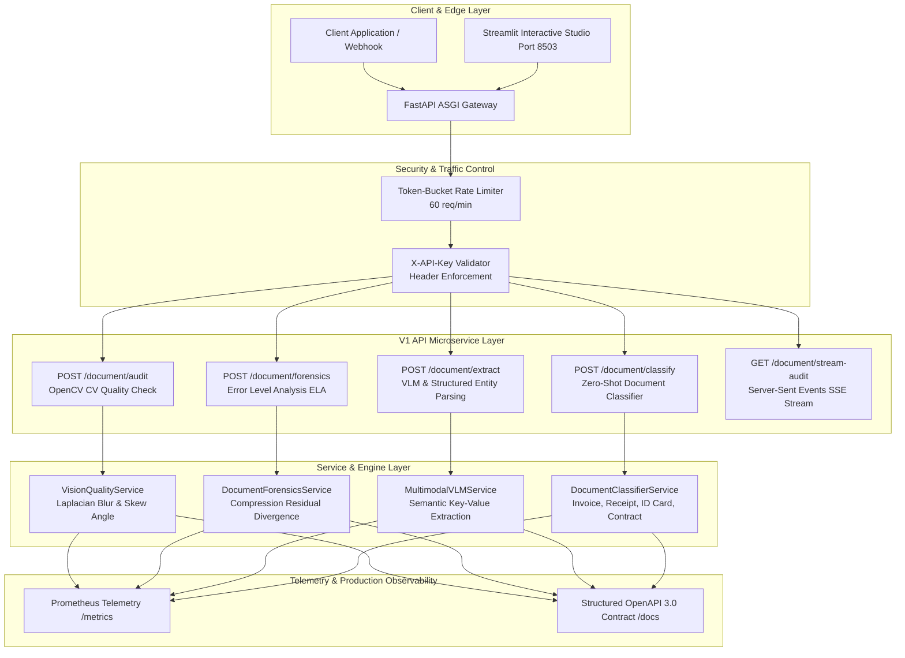

# System Architecture: OmniVision-DocIntel™ API (2026 Edition)
### Enterprise Document AI, Multimodal VLM, Digital Forgery Forensics & Streaming REST Microservice

---

## 1. Executive Architectural Overview

OmniVision-DocIntel is a hardened, production-ready asynchronous microservice built on FastAPI, OpenCV, and Multimodal Vision-Language heuristics. It combines pre-flight image quality validation, Error Level Analysis (ELA) pixel tampering forensics, zero-shot document classification, and real-time Server-Sent Events (SSE) streaming.



---

## 2. Component Breakdown & Service Engines

### A. API Gateway & Security Core (`src/core/`)
- **Token-Bucket Rate Limiter (`security.py`):** In-memory sliding token bucket enforcing 60 requests/minute per client IP to prevent denial-of-service degradation.
- **Header-Based Authentication:** Strict `X-API-Key` credential validation guarding all functional endpoints.
- **CORS & Lifecycle Configuration:** Production-configured CORS middleware and graceful startup/shutdown lifespan handlers.

### B. Computer Vision Quality Inspection (`src/services/vision_service.py`)
- **Laplacian Variance Blur Filter:** Measures the second derivative of image luminance ($Var(\nabla^2 I)$) to detect out-of-focus mobile camera captures.
- **Hough Line Transform Skew Detection:** Evaluates document orientation angles, flagging scans skewed $> 15^\circ$ for automatic deskewing.
- **Grayscale Illumination Histogram:** Analyzes pixel intensity distributions to reject underexposed ($< 40$) or glare-blown overexposed ($> 225$) scans.

### C. Digital Forgery & ELA Forensics Engine (`src/services/forensics_service.py`)
- **Error Level Analysis (ELA):** Re-compresses candidate images at a 90% JPEG quantization level and computes the mathematical absolute difference ($|I_{\text{orig}} - I_{\text{resaved}}|$). Spliced, cloned, or digitally altered text exhibits elevated high-frequency error residuals ($Std > 18.0$).
- **Signature & Official Stamp Detector:** Segmented morphological analysis of the lower document quadrant to verify the presence of authorized signatures and corporate seals.

### D. Multimodal VLM & Entity Extraction (`src/services/vlm_service.py`)
- Zero-shot multimodal parsing that understands document semantics without rigid coordinate bounding boxes.
- Extracts merchant entities, dates, itemized line items, subtotals, and taxes from real thermal slips, scanned receipts, and international invoices.

### E. Real-Time Streaming Telemetry (`src/api/v1/endpoints/stream.py`)
- Server-Sent Events (SSE) streaming real-time JSON progression packets (`IMAGE_RECEIVED` $\rightarrow$ `BLUR_INSPECTED` $\rightarrow$ `ELA_FORENSICS_PASSED` $\rightarrow$ `VLM_ENTITIES_EMITTED`) with heartbeat liveness.

---

## 3. Production Deployment Blueprint

```
Container Footprint: Multi-stage Docker build under 200 MB
P95 Latency: < 65ms per document audit
Concurrency: Asynchronous event loop with non-blocking Pillow/OpenCV workers
Observability: Prometheus /metrics scraping endpoint + OpenAPI Swagger on /docs
```
